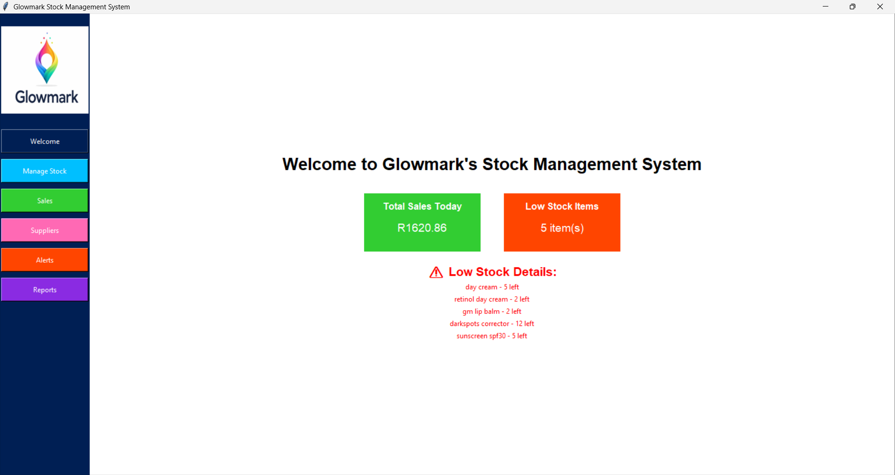
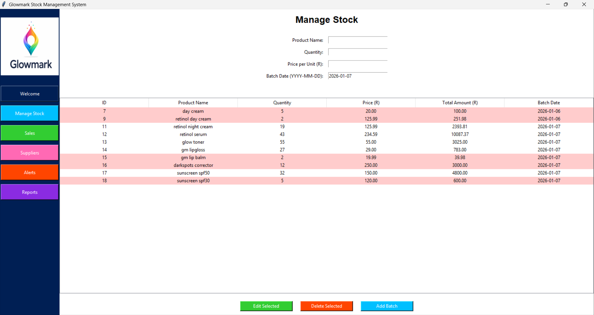
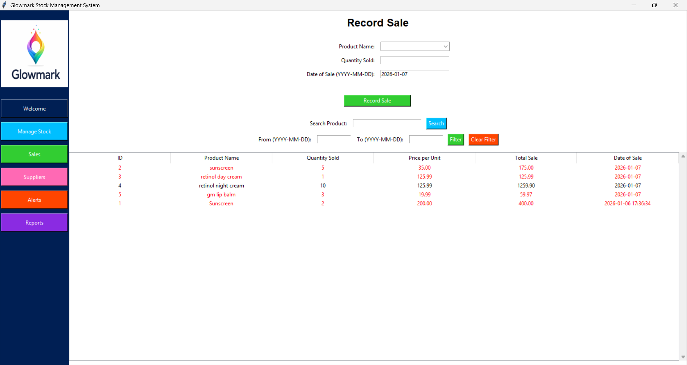
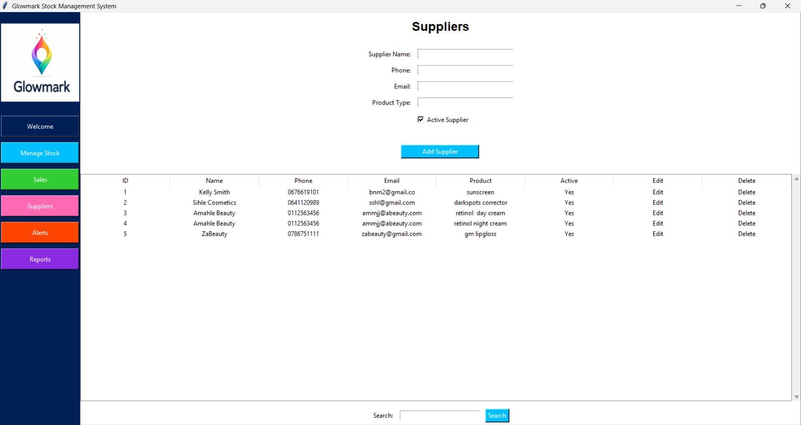
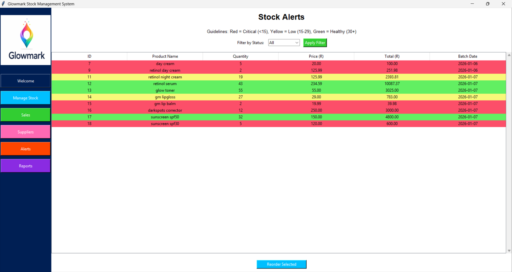
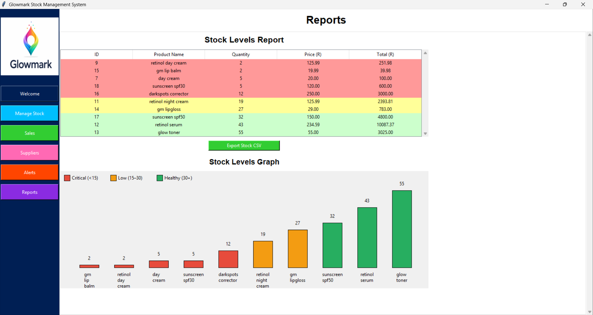

# Glowmark Stock Management System 💄📊 (Mock Project)

The **Glowmark Stock Management System** is a mock desktop application developed for a fictional facial-product business. The project demonstrates how small businesses can move from manual stock tracking to a structured, digital inventory system.

This project was created to showcase **information systems analysis, business logic, database design and system development skills**.

## Business Problem

Glowmark currently manages its inventory manually, which leads to:  

- Inaccurate stock counts
- Stock shortages or overstocking
- Difficulty tracking suppliers and sales
- No clear visibility of low stock items
- Time-consuming manual reporting

## Business Solution

The Glowmark Stock Management System provides a structured solution that:

- Tracks products and their quantities  
- Records sales transactions
- Manages supplier information
- Monitors stock levels and flags low stock
- Generates clear inventory reports

## Key Features

**Welcome Dashboard**

- Displays total products
- Displays total sales
- Displays low-stock item count

**Stock Management**

- Add, update, and view products
- Automatic quantity calculations

**Sales Management**

- Record product sales
- Automatically updates stock levels

**Supplier Management**

- Store supplier names and contact details
- Supports restocking workflows

**Stock Alerts**

- Color-coded stock levels:
  - 🔴 Critical (below 15)
  - 🟡 Low (15–29)
  - 🟢 Healthy (30+)
- Filter products by stock status
- Reorder shortcut linked to suppliers

**Reports**

- Stock level report displayed in table format
- Bar graph visualization of stock levels
- Export stock data to CSV 
- Sorted to highlight low-stock items first

## Conceptual Database Design

| Table Name             | Fields / Attributes                                                                | Description                                                |
| ---------------------- | ---------------------------------------------------------------------------------- | ---------------------------------------------------------- |
| **PRODUCTS**           | ProductID (PK), Name, Category, Price, Quantity                                    | Stores all facial products sold by Glowmark                |
| **SUPPLIERS**          | SupplierID (PK), Name, Phone, Email, ProductType                                   | Stores supplier contact details and supplied product types |
| **STOCK_TRANSACTIONS** | TransactionID (PK), Date, ProductID (FK), QuantityIn, QuantityOut, SupplierID (FK) | Records all stock movement (purchases and sales)           |
| **REORDER_ALERTS**     | AlertID (PK), ProductID (FK), MinimumQuantity, AlertStatus                         | Monitors low stock levels and triggers reorder alerts      |
| **SALES**              | SaleID (PK), ProductID (FK), QuantitySold, TotalSale, DateSold                     | Tracks all product sales for reporting                     |

## Technologies Used

- **Programming & Language:** Python
- **User Interface:** Tkinter  
- **Database:** SQLite  
- **Version Control & Portfolio:** GitHub

## How to Run the Project

1.	**Open the repository in GitHub**
   
Ensure the repository contains the following files:
 - glowmark_app.py (main Python file)
 - glowmark_stock.db (database)
 - glowmark_logo.png (logo)
 - Screenshots (uploaded individually)
   
2.	**Download the files to your computer**
 - Click each file → Download.
 - Save all files into one folder (e.g., Glowmark_Stock_Management).
   
3.	**Open the project folder in VS Code**
 - Make sure all downloaded files are in the same folder.
   
4.	**Run the application**
 - Open glowmark_app.py in VS Code.
 - Open the terminal (Terminal → New Terminal).
 - Type the following command and press Enter:
   
   **python glowmark_app.py**
   
 - If your system uses Python 3 specifically, type:
   
   **python3 glowmark_app.py**
   
5.	**Use the application**
 - The desktop window will open.
 - Navigate through the Welcome, Manage Stock, Sales, Suppliers, Alerts, and Reports pages.
 - Export CSV files if needed from the Reports page.

## Project Type
This is a mock project created for learning, portfolio, and demonstration purposes.
It is not a live commercial system.

## Author
Khensani Cossa

Bcom Information Systems Graduate | University of the Witwatersrand
